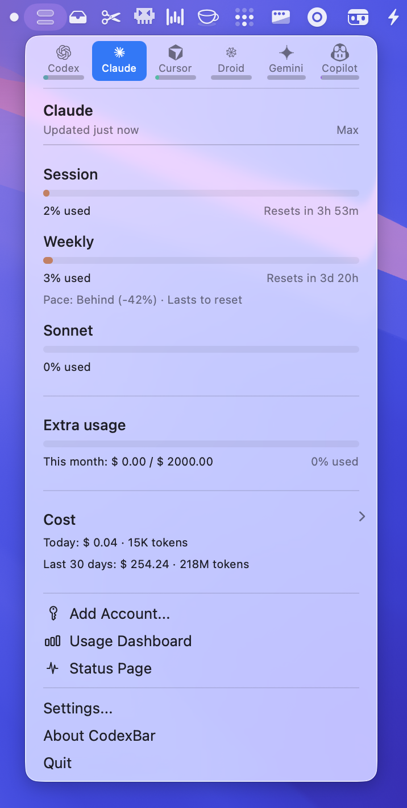

# TokenBar 🎚️ — Your AI usage, in your menu bar

> macOS 14+ menu bar app for monitoring AI API usage across providers.
> Forked from [steipete/CodexBar](https://github.com/steipete/CodexBar) with **native Krill**, **Custom provider**, and TokenBar-branded release/configuration support.



## Supported Providers

TokenBar keeps your API limits visible at a glance. Enable what you use:

| Provider | Status | Notes |
|----------|--------|-------|
| [**Codex**](docs/codex.md) | Native | OpenAI Codex (OAuth + web) |
| [**Claude**](docs/claude.md) | Native | Anthropic Claude Code |
| [**Krill**](docs/krill.md) | Native | Wallet balance, credits remaining, request stats |
| [**Custom**](docs/custom.md) | Native | Any OpenAI-compatible endpoint |
| [**Codebuff**](docs/codebuff.md) | Native | Credit balance + weekly rate limit |
| [**Windsurf**](docs/windsurf.md) | Native | Web-session usage + local cache fallback |
| [Cursor](docs/cursor.md) | Native | Cursor IDE |
| Gemini | Native | Google Gemini |
| [Copilot](docs/copilot.md) | Native | GitHub Copilot, including multi-account support |
| [OpenRouter](docs/openrouter.md) | Native | OpenRouter API |
| [DeepSeek](docs/deepseek.md) | Native | API-key balance + token-account support |
| ... and 20+ more | | See [all providers](docs/providers.md) |

## What's New in TokenBar (vs CodexBar)

### Krill Provider (Native)
- **WebView JWT login** — secure one-time login via Krill's website
- **Wallet balance** — USD wallet at a glance
- **Elite Credits** — plan credits progress bar
- **尊享月卡 Requests** — monthly request quota tracking
- **Cache rate & models** — detailed usage breakdown at login
- **JWT stored securely** in macOS Keychain, auto-refresh on expiry
- 🔗 [Register Krill](https://www.krill-ai.com/register?invite=XIM6RGTQRM) (affiliate link)

### Custom Provider
Add any OpenAI-compatible endpoint to `~/.tokenbar/config.json`:

```json
{
  "id": "custom",
  "enabled": false,
  "customName": "Your Provider",
  "baseURL": "https://api.example.com/v1",
  "apiKey": "<redacted>",
  "customModelFilter": "gpt-4"
}
```

### Upstream CodexBar v0.24 sync
This fork selectively imports upstream v0.24 improvements while preserving TokenBar branding, config paths, and release flow:
- Codebuff and Windsurf providers
- Copilot multi-account / Enterprise improvements
- provider storage-footprint menu
- Codex/OpenAI dashboard resilience and RPC timeout fixes
- Keychain no-UI reads, menu/status item stability, reset countdown preservation
- Alibaba/MiniMax environment-variable aliases

## Quick Start

### Homebrew Cask

```bash
brew tap y0shua1ee/tokenbar
brew install --cask tokenbar
```

Upgrade later with:

```bash
brew upgrade --cask tokenbar
```

The cask installs `TokenBar.app` into `/Applications` and links the bundled CLI as `tokenbar`.
Current fork builds are adhoc-signed, arm64-only, and require macOS 14+.

### Download (Pre-built)
Download the latest adhoc-signed build from [GitHub Releases](https://github.com/y0shua1ee/TokenBar/releases/latest).
**First launch**: right-click → Open, or allow in System Settings → Privacy & Security.

### Build from Source

```bash
# Build and run
cd TokenBar
swift build
./.build/debug/TokenBar

# Or use the build script
./Scripts/compile_and_run.sh
```

TokenBar runs in your menu bar (no Dock icon). Configure providers via **Settings** (⌘,).

## CLI

TokenBar includes a bundled `tokenbar` CLI for scripts and CI. Release tarballs are named like:

```text
TokenBarCLI-v<tag>-macos-arm64.tar.gz
TokenBarCLI-v<tag>-linux-x86_64.tar.gz
```

After installing `TokenBar.app`, install the helper from the app's Advanced settings or via the repo script:

```bash
./bin/install-tokenbar-cli.sh
```

## Configuration

Provider settings are stored in `~/.tokenbar/config.json`. See [docs/configuration.md](docs/configuration.md) and `config.example.json` for available options.

## Docs

- Providers overview: [docs/providers.md](docs/providers.md)
- CLI reference: [docs/cli.md](docs/cli.md)
- Configuration: [docs/configuration.md](docs/configuration.md)
- Widgets: [docs/widgets.md](docs/widgets.md)
- Development: [docs/DEVELOPMENT.md](docs/DEVELOPMENT.md)
- Release checklist: [docs/RELEASING.md](docs/RELEASING.md)
- Changelog: [CHANGELOG.md](CHANGELOG.md)

## Credits

- **Original project**: [steipete/CodexBar](https://github.com/steipete/CodexBar) by Peter Steinberger
- **License**: MIT (retained from upstream)
- **Contributor**: [@y0shua1ee](https://github.com/y0shua1ee)

## License

MIT © 2026 — see [LICENSE](LICENSE)
